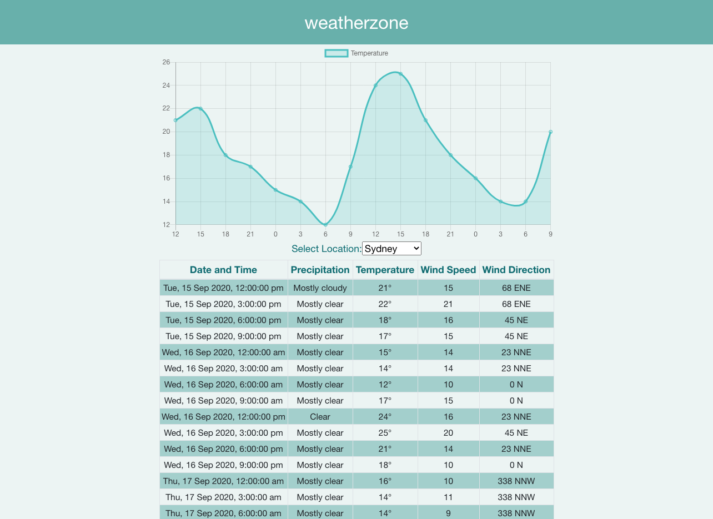

## A Weather App

Made in React with BootStrap(for styling the components) and ChartJS(to display temperature in Line chart)

A basic weather app to display the temprature forcast for next 48 hours.
weatherzone api used to fetch the weather data.
Functional Components and Hooks are used.

The dropdown has fixed set of Cities [Adelaide, Brisbane, Canberra, Darwin, Hobart, Melbourne, Perth, Sydney]
The chart and the table with the weather details are updated on selecting a different city.

## Future Upgrade

● Componets needs to be in seperate files
● The dropdown data can be dynamic
● Caching the API responses
● Provide a date selector for start / end dates
● Add more weather data to the meteogram provided in the web service
● Add toggles to the meteogram to show/hide weather data
● Change units from Celsius to Fahrenheit, knots to km/h
● Show information about the data point the user is hovering over

## Available Scripts

In the project directory, you can run:

### `yarn start`

Runs the app in the development mode. 
Open [http://localhost:3000](http://localhost:3000) to view it in the browser.
